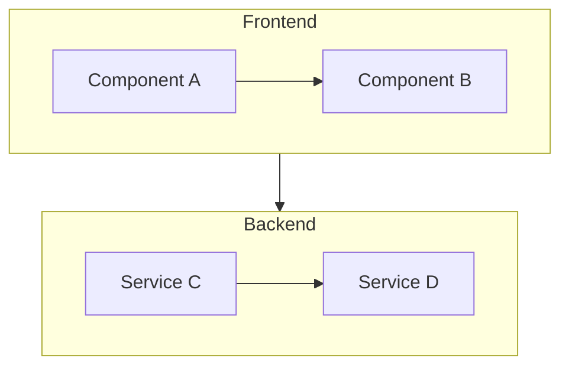
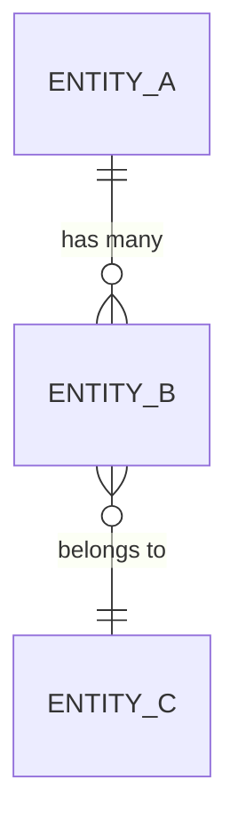

# Design Document: [Feature Name]

## Overview

[Brief description of the technical approach and what this design accomplishes]

### Design Principles

1. **[Principle 1]**: [e.g., Lightweight first - avoid heavy dependencies]
2. **[Principle 2]**: [e.g., Single implementation - no duplicate code paths]
3. **[Principle 3]**: [e.g., Complete connection - all modules properly imported]

---

## Architecture

### System Diagram



### Components

| Component | Responsibility | File(s) |
|-----------|---------------|---------|
| [Component 1] | [What it does] | `path/to/file.ext` |
| [Component 2] | [What it does] | `path/to/file.ext` |
| [Component 3] | [What it does] | `path/to/file.ext` |

---

## Components and Interfaces

### 1. [Component Name] (NEW/MODIFY)

```typescript
// path/to/file.ts
interface ComponentInterface {
  property: string;
  method(): void;
}

// Key methods
function keyMethod(param: Type): ReturnType;
```

### 2. [Component Name] (NEW/MODIFY)

```python
# path/to/file.py
class ComponentClass:
    def __init__(self, param: Type):
        pass
    
    async def key_method(self) -> ReturnType:
        """Description of method behavior"""
        pass
```

---

## Data Models

### [Entity Name]

```typescript
interface EntityName {
  id: string;
  field1: string;
  field2: number;
  createdAt: Date;
  updatedAt: Date;
}
```

### Relationships



---

## Correctness Properties

> *A property is a characteristic or behavior that should hold true across all valid executions. Properties bridge human-readable specs and machine-verifiable correctness.*

### Property 1: [Property Name]
*For any* [input/condition], the [System_Component] should [expected behavior].
**Validates: Requirements 1.1, 1.2**

### Property 2: [Property Name]
*For any* [input/condition], the [System_Component] should [expected behavior].
**Validates: Requirements 2.1**

### Property 3: [Property Name]
*For any* [input/condition], the [System_Component] should [expected behavior].
**Validates: Requirements 3.1, 3.2**

---

## Error Handling

| Error Type | Handling Strategy |
|------------|-------------------|
| [Network errors] | [Retry with exponential backoff] |
| [Validation errors] | [Return structured error message] |
| [Timeout] | [Cancel and notify user] |

---

## Testing Strategy

### Unit Tests
- [Component A] - test individual methods
- [Component B] - test edge cases

### Property-Based Tests
- **Property 1** - [framework: Hypothesis/fast-check]
- **Property 2** - [framework: Hypothesis/fast-check]

### Integration Tests
- End-to-end flow testing
- Cross-component communication

---

## Files Summary

### Files to Create
| File | Purpose |
|------|---------|
| `path/to/new/file.ext` | [Description] |

### Files to Modify
| File | Changes |
|------|---------|
| `path/to/existing/file.ext` | [What changes] |

### Files to Delete
| File | Reason |
|------|--------|
| `path/to/deprecated/file.ext` | [Why removing] |

---

## Requirements Mapping

| Requirement | Addressed By |
|-------------|--------------|
| Requirement 1 | [Component/Property] |
| Requirement 2 | [Component/Property] |
| Requirement 3 | [Component/Property] |

---

## Approval

- [ ] Architecture reviewed
- [ ] Security considerations addressed
- [ ] Ready for Implementation phase
