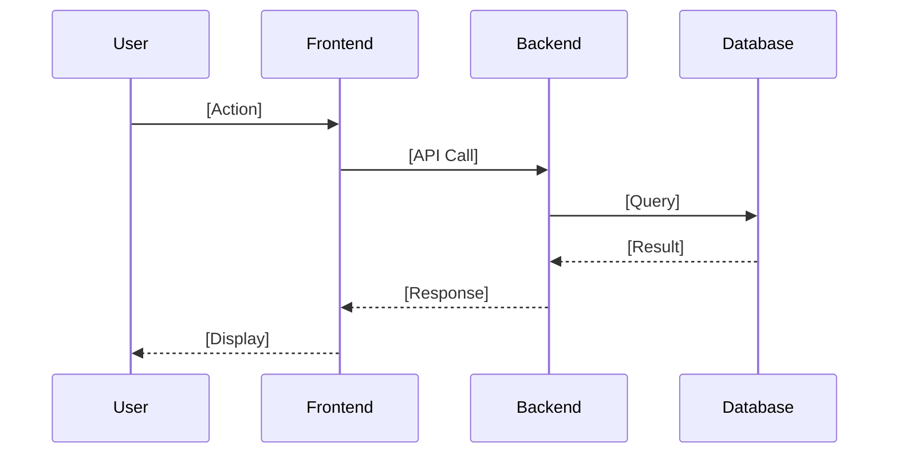
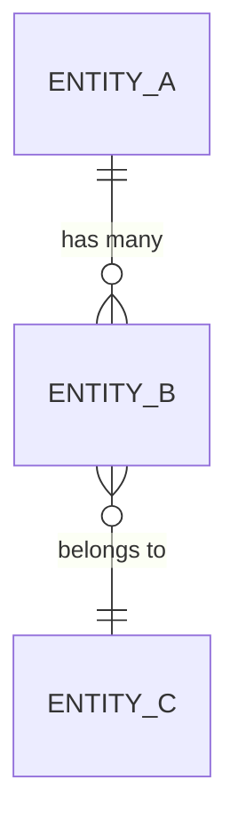

# Design: [Feature Name]

> **Created**: YYYY-MM-DD
> **Requirements**: [Link to requirements.md]
> **Status**: 🟡 Draft | 🟢 Approved

---

## Overview

[Brief description of the technical approach and key decisions]

---

## Architecture

### Components

| Component | Responsibility | File(s) |
|-----------|---------------|---------|
| [Component 1] | [What it does] | `path/to/file.ext` |
| [Component 2] | [What it does] | `path/to/file.ext` |
| [Component 3] | [What it does] | `path/to/file.ext` |

### Sequence Diagram



---

## Data Model

### Entities

```
[Entity Name]
├── id: UUID (PK)
├── field1: string
├── field2: number
├── created_at: timestamp
└── updated_at: timestamp
```

### Relationships



---

## API Design

### Endpoints

| Method | Endpoint | Description | Request | Response |
|--------|----------|-------------|---------|----------|
| POST | `/api/resource` | Create resource | `{ field: value }` | `201: { id, ... }` |
| GET | `/api/resource/:id` | Get resource | - | `200: { ... }` |
| PUT | `/api/resource/:id` | Update resource | `{ field: value }` | `200: { ... }` |
| DELETE | `/api/resource/:id` | Delete resource | - | `204` |

---

## Considerations

### Security

- [ ] Authentication required?
- [ ] Authorization (role-based)?
- [ ] Input validation
- [ ] Data sanitization

### Performance

- [ ] Caching strategy
- [ ] Query optimization
- [ ] Pagination needed?

### Edge Cases

| Scenario | Handling |
|----------|----------|
| [Edge case 1] | [How to handle] |
| [Edge case 2] | [How to handle] |

---

## Requirements Mapping

| Requirement | Addressed By |
|-------------|--------------|
| US-1 | [Component/Endpoint] |
| US-2 | [Component/Endpoint] |

---

## Approval

- [ ] Architecture reviewed
- [ ] Security considerations addressed
- [ ] Ready for Implementation phase
