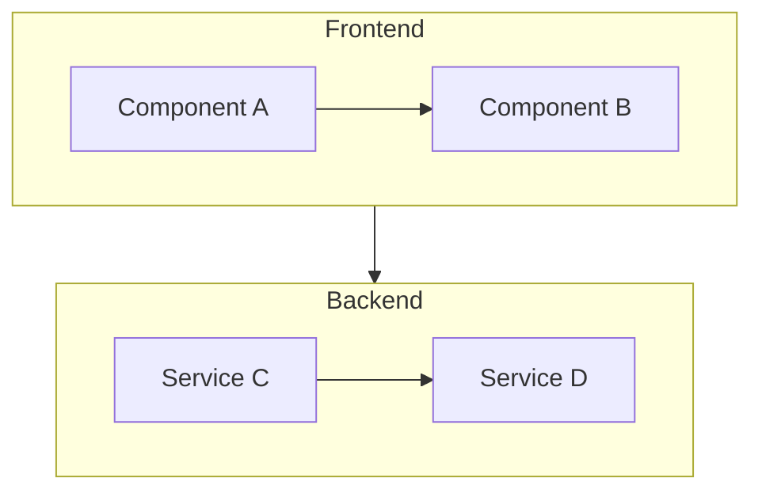
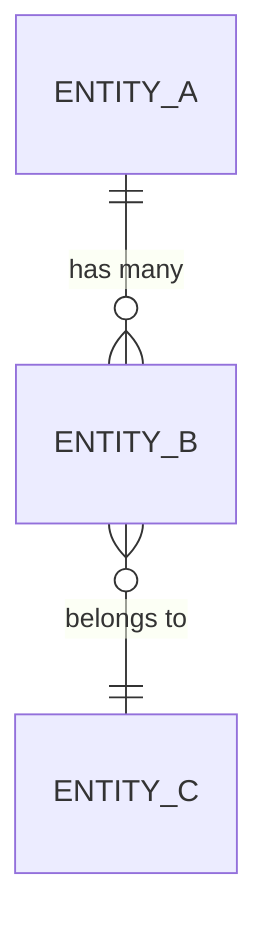

# Design: {{FEATURE_NAME}}

> **Phase**: 3/5 - Design  
> **Input**: [research.md](./research.md), [requirements.md](./requirements.md)  
> **Created**: {{DATE}}  
> **Status**: 🟡 Draft | 🟢 Approved

---

## Overview

{{Brief description of the technical approach and architecture}}

### Design Principles

1. **{{Principle 1}}**: {{e.g., Lightweight first — avoid heavy dependencies}}
2. **{{Principle 2}}**: {{e.g., Single source of truth — no duplicate state}}
3. **{{Principle 3}}**: {{e.g., Fail fast — validate early}}

---

## Architecture

### System Diagram



### Component Overview

| Component | Responsibility | File(s) | Covers REQs |
|-----------|---------------|---------|-------------|
| {{Component 1}} | {{What it does}} | `{{path/to/file}}` | REQ-001, REQ-002 |
| {{Component 2}} | {{What it does}} | `{{path/to/file}}` | REQ-003 |

---

## Component Details

### 1. {{Component Name}} (NEW)

<!-- ACTION REQUIRED: Define interface with actual types -->

```typescript
// {{path/to/file.ts}}
interface {{ComponentInterface}} {
  {{property}}: {{Type}};
  {{method}}(): {{ReturnType}};
}
```

**Why This Design**: {{Rationale for this approach}}

**Covers**: REQ-001, REQ-002

---

### 2. {{Component Name}} (MODIFY)

```python
# {{path/to/file.py}}
class {{ComponentClass}}:
    def __init__(self, {{param}}: {{Type}}):
        pass
    
    async def {{method}}(self) -> {{ReturnType}}:
        """{{Description}}"""
        pass
```

**Why This Design**: {{Rationale}}

**Covers**: REQ-003

---

## Data Models

### {{Entity Name}}

```typescript
interface {{EntityName}} {
  id: string;
  {{field1}}: {{Type}};
  {{field2}}: {{Type}};
  createdAt: Date;
  updatedAt: Date;
}
```

### Relationships



---

## Design Decisions (ADR-style)

### Decision 1: {{Topic}}

**Context**: {{Problem statement}}

**Decision**: {{Chosen approach}}

**Why**: 
- {{Reason 1}}
- {{Reason 2}}

**Alternatives Rejected**:
| Alternative | Rejected Because |
|-------------|------------------|
| {{Option A}} | {{Reason}} |
| {{Option B}} | {{Reason}} |

**Trade-offs**:
- ✅ {{Benefit}}
- ⚠️ {{Drawback to accept}}

---

## Error Handling

| Error Type | Handling Strategy |
|------------|-------------------|
| {{Network errors}} | {{Retry with exponential backoff}} |
| {{Validation errors}} | {{Return structured error message}} |
| {{Timeout}} | {{Cancel and notify user}} |

---

## Testing Strategy

### By Requirement Priority

| Priority | Test Type | Coverage |
|----------|-----------|----------|
| P1 (MVP) | Unit + Integration | 100% |
| P2 | Unit | 80%+ |
| P3 | Unit | Best effort |

### Test Plan

- **Unit Tests**: {{Component A, Component B}}
- **Integration Tests**: {{End-to-end flow}}
- **Property Tests**: {{If applicable — Hypothesis/fast-check}}

---

## Files Summary

### Files to CREATE

| File | Component | Purpose |
|------|-----------|---------|
| `{{path/to/new.ts}}` | {{Component 1}} | {{Description}} |

### Files to MODIFY

| File | Changes | Risk |
|------|---------|------|
| `{{path/to/existing.ts}}` | {{What changes}} | 🟢/🟡/🔴 |

---

## Requirements Traceability

<!-- ACTION REQUIRED: Every REQ must map to at least one component -->

| REQ ID | Requirement | Component | Test Strategy |
|--------|-------------|-----------|---------------|
| REQ-001 | {{Title}} | {{Component 1}} | Unit + Integration |
| REQ-002 | {{Title}} | {{Component 1}} | Unit |
| REQ-003 | {{Title}} | {{Component 2}} | Integration |

---

## Quality Self-Check

Before marking complete, verify:

- [ ] All REQ-XXX are mapped to components
- [ ] At least 2 alternatives were considered for major decisions
- [ ] Trade-offs are documented (both pros and cons)
- [ ] Mermaid diagrams render correctly
- [ ] File paths are specific (not generic)
- [ ] Error handling is defined

---

## → Next Phase

**Output**: This design.md  
**Next**: tasks.md (Phase 4)  
**Handoff**: Ready for `ouroboros-tasks` agent
