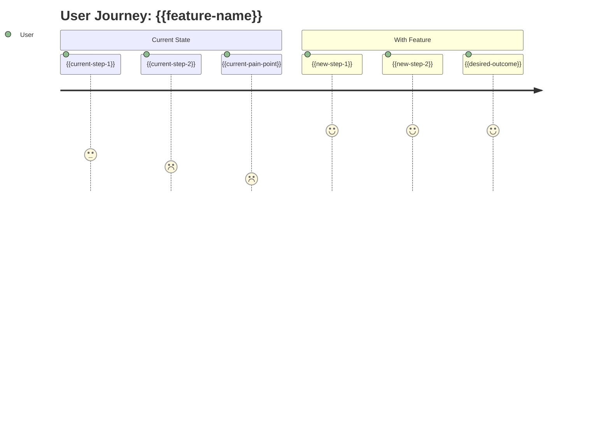

# PRD: {{feature-name}}

> **Version**: 1.0  
> **Created**: {{date}}  
> **Status**: Draft | Review | Approved

---

## Executive Summary

> [!TIP]
> **For leadership and stakeholders — read this section first.**

**What**: {{one-sentence-description}}

**Why**: {{primary-business-value}}

**Who**: {{target-users}}

**When**: {{target-timeline}}

**Success Metric**: {{primary-kpi}}

---

## 1. Problem Statement

### 1.1 The Problem
{{problem-description}}

### 1.2 Current State
{{current-state}}

### 1.3 Impact of Not Solving
{{impact}}

---

## 2. User Analysis

### 2.1 Primary User Persona

| Attribute | Description |
|-----------|-------------|
| **Role** | {{user-role}} |
| **Goal** | {{user-goal}} |
| **Pain Points** | {{user-pain-points}} |
| **Current Workaround** | {{current-workaround}} |

### 2.2 User Journey



### 2.3 Secondary Users (if any)
- {{secondary-user-1}}: {{their-need}}
- {{secondary-user-2}}: {{their-need}}

---

## 3. Feature Scope

### 3.1 MVP Features (Must Have)

| # | Feature | Description | Acceptance Criteria |
|---|---------|-------------|---------------------|
| 1 | {{mvp-feature-1}} | {{description}} | {{when-x-then-y}} |
| 2 | {{mvp-feature-2}} | {{description}} | {{when-x-then-y}} |
| 3 | {{mvp-feature-3}} | {{description}} | {{when-x-then-y}} |

### 3.2 Nice-to-Have Features (Post-MVP)

| # | Feature | Description | Rationale for Deferral |
|---|---------|-------------|------------------------|
| 1 | {{nice-feature-1}} | {{description}} | {{why-not-mvp}} |
| 2 | {{nice-feature-2}} | {{description}} | {{why-not-mvp}} |

### 3.3 Out of Scope

> [!WARNING]
> The following are explicitly **NOT** part of this feature:

| Item | Reason |
|------|--------|
| {{out-of-scope-1}} | {{why-excluded}} |
| {{out-of-scope-2}} | {{why-excluded}} |
| {{out-of-scope-3}} | {{why-excluded}} |

---

## 4. Success Metrics

### 4.1 Key Performance Indicators (KPIs)

| Metric | Current Baseline | Target | Measurement Method | Timeline |
|--------|-----------------|--------|-------------------|----------|
| {{metric-1}} | {{current}} | {{target}} | {{method}} | {{when}} |
| {{metric-2}} | {{current}} | {{target}} | {{method}} | {{when}} |

### 4.2 Qualitative Success Criteria

- [ ] {{qualitative-criteria-1}}
- [ ] {{qualitative-criteria-2}}
- [ ] {{qualitative-criteria-3}}

### 4.3 Priority Focus

**Primary Focus**: {{priority-focus}}

| Priority | This Project | Rationale |
|----------|-------------|-----------|
| Speed to Market | {{high/med/low}} | {{why}} |
| Code Quality | {{high/med/low}} | {{why}} |
| User Experience | {{high/med/low}} | {{why}} |
| Scalability | {{high/med/low}} | {{why}} |

---

## 5. Constraints & Boundaries

### 5.1 Technical Constraints

| Constraint | Description | Impact | Mitigation |
|------------|-------------|--------|------------|
| {{tech-constraint-1}} | {{description}} | {{impact}} | {{how-to-handle}} |
| {{tech-constraint-2}} | {{description}} | {{impact}} | {{how-to-handle}} |

### 5.2 Business Constraints

| Constraint | Value | Impact |
|------------|-------|--------|
| Timeline | {{deadline}} | {{impact}} |
| Budget | {{amount}} | {{impact}} |
| Resources | {{team-size}} | {{impact}} |
| Compliance | {{requirements}} | {{impact}} |

### 5.3 External Dependencies

| Dependency | Owner | Status | Risk Level | Mitigation |
|------------|-------|--------|------------|------------|
| {{dependency-1}} | {{owner}} | {{status}} | {{risk}} | {{mitigation}} |
| {{dependency-2}} | {{owner}} | {{status}} | {{risk}} | {{mitigation}} |

---

## 6. Risks & Mitigations

> [!CAUTION]
> Key risks identified during PRD creation:

| Risk | Likelihood | Impact | Mitigation Strategy |
|------|------------|--------|---------------------|
| {{risk-1}} | {{H/M/L}} | {{H/M/L}} | {{how-to-mitigate}} |
| {{risk-2}} | {{H/M/L}} | {{H/M/L}} | {{how-to-mitigate}} |
| {{risk-3}} | {{H/M/L}} | {{H/M/L}} | {{how-to-mitigate}} |

---

## 7. Timeline & Milestones

```mermaid
gantt
    title {{feature-name}} Timeline
    dateFormat  YYYY-MM-DD
    section Planning
    PRD & Spec      :done, prd, {{start-date}}, 1w
    Design Review   :active, design, after prd, 3d
    section Development
    MVP Build       :dev, after design, 2w
    Testing         :test, after dev, 1w
    section Launch
    Soft Launch     :launch, after test, 3d
    Full Rollout    :rollout, after launch, 1w
```

| Milestone | Target Date | Owner | Status |
|-----------|------------|-------|--------|
| PRD Approved | {{date}} | PM | {{status}} |
| Design Complete | {{date}} | Design | {{status}} |
| MVP Ready | {{date}} | Engineering | {{status}} |
| Launch | {{date}} | PM | {{status}} |

---

## 8. Open Questions

> [!NOTE]
> Questions to clarify before implementation:

| # | Question | Owner | Due Date | Status |
|---|----------|-------|----------|--------|
| 1 | {{open-question-1}} | {{who}} | {{when}} | Open |
| 2 | {{open-question-2}} | {{who}} | {{when}} | Open |

---

## 9. Appendix

### 9.1 Related Documents

- PRD: This document
- Research: `.ouroboros/specs/{{feature-name}}/research.md`
- Requirements: `.ouroboros/specs/{{feature-name}}/requirements.md`
- Design: `.ouroboros/specs/{{feature-name}}/design.md`

### 9.2 Stakeholders

| Role | Name | Responsibility |
|------|------|----------------|
| Product Owner | {{name}} | Final approval |
| Tech Lead | {{name}} | Technical feasibility |
| Designer | {{name}} | UX/UI |
| QA Lead | {{name}} | Quality assurance |

### 9.3 Revision History

| Version | Date | Author | Changes |
|---------|------|--------|---------|
| 1.0 | {{date}} | AI-Guided | Initial draft |

---

**♾️ From Vision to Reality. The PRD Guides the Spec. ♾️**
