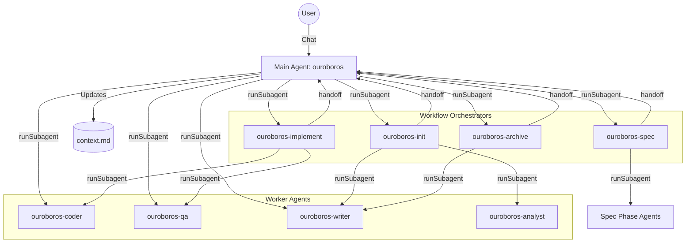

# ♾️ Project Ouroboros v3.3.7

> **Save Money on GitHub Copilot** — A persistent context system that reduces redundant conversations and maximizes your Copilot subscription value.

[](https://opensource.org/licenses/MIT)
[](https://github.com/features/copilot)
[](https://github.com/MLGBJDLW/ouroboros/releases)
[](https://marketplace.visualstudio.com/items?itemName=MLGBJDLW.ouroboros-ai)
[](https://github.com/MLGBJDLW/ouroboros/actions/workflows/ci.yml)

---

## 💰 Why Ouroboros?

GitHub Copilot charges by **request count**. Every time you re-explain your project, tech stack, or rehash previous conversations, you're **wasting requests**.

Ouroboros solves this:

| Problem | Ouroboros Solution |
|---------|-------------------|
| Re-introducing project every session | 🧠 **Persistent Memory** — AI reads `history/context-*.md` automatically |
| AI forgets after each response | ♾️ **Never Say Goodbye** — AI doesn't end conversations |
| Vague instructions cause rework | 🎯 **Sub-Agent Routing** — Tasks auto-route to specialists via `runSubagent` |
| Code gets lost in handoffs | 📦 **Lossless Artifacts** — Code passed verbatim, never summarized |

---

## 🚀 Quick Start (3 Steps!)

> **Requirement**: Python 3.9+ must be installed on your system. The Continuous Command Loop uses `python -c` for terminal interaction.

### Step 1: Copy to Your Project

**Option A: Download Release (Recommended)**

1. Download the latest `ouroboros-vX.X.X.zip` from [Releases](https://github.com/MLGBJDLW/ouroboros/releases)
2. Extract to your project root
3. Done! You should now have `.github/` and `.ouroboros/` folders

**Option B: Git Clone**

```bash
git clone https://github.com/MLGBJDLW/ouroboros.git .ouroboros-temp
cp -r .ouroboros-temp/.github .
cp -r .ouroboros-temp/.ouroboros .
rm -rf .ouroboros-temp
```

Either way, your project should have:
- `.github/` — Copilot instructions and agents
- `.ouroboros/` — Persistent memory system

### Step 2: Enable Custom Instructions in VS Code

1. Open Settings (`Ctrl+,` / `Cmd+,`)
2. Search: `github.copilot.chat.codeGeneration.useInstructionFiles`
3. ✅ **Enable it**

### Step 3: Enable VS Code Settings (Important!)

Enable these settings for full functionality:

| Setting | Search For | Purpose |
|---------|------------|---------|
| 🔧 **Custom Instructions** | `github.copilot.chat.codeGeneration.useInstructionFiles` | Load `.github/copilot-instructions.md` |
| 🤖 **Agent Mode** | `github.copilot.chat.agent` | Enable agent-based interactions |

> **Note**: Ouroboros v2.0 requires the **Main Orchestrator Agent** (`ouroboros.agent.md`). Do not invoke subagents directly; always start with `/ouroboros`.

> [!WARNING]
> **Context Window Limitation**: Due to AI provider token limits, the context window may become exhausted after approximately **1 hour** of continuous use. When this happens:
> - The AI may lose track of previous context
> - Performance may degrade or the session may stop responding
>
> This is an inherent limitation of current AI technology, not a bug in Ouroboros.

### Step 4: Configure Agent Tools & MCP (Optional)

Each agent's tools can be configured via VS Code's agent settings:

1. Open agent file (e.g., `.github/agents/ouroboros-coder.agent.md`)
2. Click the ⚙️ gear icon to open tools configuration
3. Enable/disable tools as needed (`edit`, `execute`, `memory`, etc.)

**For MCP Servers**: Add your MCP configuration to `.vscode/mcp.json` or VS Code settings to extend agent capabilities with external tools.

---

## 🧩 VS Code Extension (v3.2.0+)

Experience Ouroboros with a rich visual interface in VS Code.

### Features

| Feature | Description |
|:---|:---|
| **Sidebar UI** | Visual workflow progress, pending requests, agent hierarchy |
| **LM Tools** | 6 tools for Copilot integration (`ouroboros_ask`, `ouroboros_menu`, etc.) |
| **Keyboard Shortcuts** | Press 1-4 to switch views, arrows to navigate |
| **Auto-Detection** | Automatically uses Extension or TUI mode |

### Installation

**From VS Code Marketplace:**
1. Open VS Code Extensions (`Ctrl+Shift+X`)
2. Search for **"Ouroboros AI"**
3. Click Install
4. Run: **Ouroboros: Initialize Project** from Command Palette (`Ctrl+Shift+P`)

**From Source:**
```bash
cd extension
npm install
npm run compile
# Then press F5 in VS Code to launch Extension Development Host
```

### Sidebar Views

| Tab | Key | Purpose |
|:---|:---|:---|
| Pending Requests | `1` | Respond to agent inputs |
| Workflow Progress | `2` | Track spec/implement phases |
| Agent Hierarchy | `3` | See current agent and handoffs |
| History | `4` | View past interactions |

> 📖 **Extension source**: [`extension/README.md`](extension/README.md)

---

## 🤖 Custom Agents (16 Total)

All agents are located in `.github/agents/`. The system uses a **hub-and-spoke** model with one main orchestrator and specialized subagents.

### Main Orchestrator
| Agent | Role |
|-------|------|
| `ouroboros` | **MAIN ORCHESTRATOR**. The only agent you talk to. Delegates everything via `runSubagent()`. |

### Workflow Orchestrators (Sub-Orchestrators)
These are specialized orchestrators for major workflows. They inherit CCL enforcement and delegation rules from the main orchestrator.

| Agent | Role | Invoked By |
|-------|------|------------|
| `ouroboros-init` | Project initialization workflow | `/ouroboros-init` |
| `ouroboros-spec` | 5-phase spec workflow | `/ouroboros-spec` |
| `ouroboros-implement` | Task execution workflow | `/ouroboros-implement` |
| `ouroboros-archive` | Archive management | `/ouroboros-archive` |

### Worker Agents (Specialists)
| Agent | Role |
|-------|------|
| `ouroboros-coder` | Full-stack development (Edit, Execute, Build) |
| `ouroboros-qa` | Unified Testing & Debugging (Fix-Verify Cycle) |
| `ouroboros-writer` | Documentation & File Writing (No code logic) |
| `ouroboros-devops` | CI/CD, Docker, Deployment |
| `ouroboros-analyst` | Read-only Codebase Analysis |
| `ouroboros-security`| Security Audits & Vulnerability Checks |

### Spec Phase Agents (Workers)
| Agent | Role |
|-------|------|
| `ouroboros-researcher` | Project Research (Phase 1) |
| `ouroboros-requirements` | EARS Requirements (Phase 2) |
| `ouroboros-architect` | System Design & ADRs (Phase 3) |
| `ouroboros-tasks` | Task Breakdown & Planning (Phase 4) |
| `ouroboros-validator` | Consistency & Logic Verification (Phase 5) |

---

## 🧠 How It Works: The v2.0 Architecture

### Centralized Orchestration

Ouroboros v2.0 uses a strict **Hub-and-Spoke** model. You never talk to the subagents; you talk to the Orchestrator, and it calls them for you.



### The Return Protocol

To prevent agents from "hallucinating" success or getting lost:
1. Orchestrator calls `runSubagent(agent: "ouroboros-coder", task: "Implement auth")`.
2. Subagent activates, reads context, does the work.
3. Subagent **MUST** return a structured result to the Orchestrator.
4. Orchestrator verifies the work and either completes the task or loops back.

---

## ♾️ Core Usage: Persistent Sessions

The foundation of Ouroboros is the **persistent session loop** — AI that never forgets and never says goodbye.

### Start a Session

```
/ouroboros
```

or simply type `/ouroboros` in Copilot Chat.

This command:
1. ✅ Loads your project context from `history/context-*.md`
2. ✅ Activates the **Continuous Command Loop (CCL)**
3. ✅ Routes tasks to specialized sub-agents automatically
4. ✅ Never ends until you say "stop", "end", "terminate", or "quit"

> [!IMPORTANT]
> **Verify Activation**: You should see a banner like:
> ```
> ♾️ OUROBOROS — SESSION ACTIVE
> ```
> If you don't see this banner or the CCL prompt `[Ouroboros] >`, **re-run `/ouroboros`** to ensure proper activation.

### The "Never Say Goodbye" Protocol

Once `/ouroboros` is active, the AI will:
- ❌ Never say "Let me know if you need anything else"
- ❌ Never end the conversation prematurely
- ✅ Always execute: `python -c "task = input('[Ouroboros] > ')"` after each task
- ✅ Wait for your next instruction continuously

---

## 🎨 Enhanced CCL Input (Optional)

Upgrade your terminal input with visual UI, command history, and intelligent content detection.

### How It Works

The toggle script automatically modifies `.github/copilot-instructions.md` to switch between:
- **Default Mode**: Uses standard `python -c "task = input()"` 
- **Enhanced Mode**: Uses `python .ouroboros/scripts/ouroboros_input.py` with full UI

### Quick Start

```bash
# Windows: double-click
.ouroboros/scripts/toggle.bat

# Mac/Linux: 
chmod +x .ouroboros/scripts/toggle.sh
.ouroboros/scripts/toggle.sh

# Command line options:
python .ouroboros/scripts/ouroboros_toggle.py                # Interactive menu
python .ouroboros/scripts/ouroboros_toggle.py --mode enhanced  # Enable
python .ouroboros/scripts/ouroboros_toggle.py --mode default   # Disable
```

### Key Features

- **Arrow Key Navigation** — Full cursor movement in Windows VS Code Terminal
- **Slash Command Autocomplete** — Type `/` for dropdown suggestions, Tab to complete
- **File Drag & Drop** — Files display as `[ filename ]` badges
- **Command History** — `↑`/`↓` to browse previous commands
- **Multi-line Input** — Dynamic box height with scrolling
- **Zero Dependencies** — Python standard library only

### Quick Reference

| Key | Action |
|-----|--------|
| `↑/↓` | History / Navigate |
| `Ctrl+D` | Submit |
| `Tab` | Complete command |
| `Ctrl+C` | Cancel |

> 📖 **Full documentation**: [`.ouroboros/scripts/README.md`](.ouroboros/scripts/README.md)

## 📋 Spec-Driven Development

For complex features, use the structured spec workflow:

| Command | Purpose |
|---------|---------|
| `/ouroboros-init` | 🆕 First-time project research & setup |
| `/ouroboros-spec` | Create Research → Requirements → Design → Tasks |
| `/ouroboros-implement` | Auto-execute tasks.md |
| `/ouroboros-archive` | Archive completed specs |

### 🎮 Execution Modes (`/ouroboros-implement`)

Choose how to execute your implementation plan:

| Mode | Speed | Control | Best For |
|------|-------|---------|----------|
| 🔧 **Task-by-Task** | Slowest | Highest | High-risk changes, learning |
| 📦 **Phase-by-Phase** | Medium | Medium | Normal development |
| 🚀 **Auto-Run All** | Fastest | Lowest | Low-risk, trusted tasks |

---

## 🛡️ Safety & Reliability

- **Destructive Command Protection**: `rm -rf`, `git reset --hard` require confirmation
- **Verification Gate**: Code is verified before delivery
- **QA Agent Fix-Verify Cycle**: Self-contained testing and debugging with 3-cycle limit
- **Fail-Safe Protocols**:
  - 🏗️ **Coder**: Must pass build/typecheck before completion
  - 🚀 **DevOps**: Auto-rollback if exit code > 0
  - 🛑 **Git**: Immediate halt on merge conflicts
- **RETURN PROTOCOL**: All subagents return to orchestrator after completion

---

## 📁 File Structure

```
your-project/
├── .github/
│   ├── copilot-instructions.md    ← Copilot reads this automatically
│   ├── agents/                    ← 🤖 Agent definitions (16 agents)
│   │   ├── ouroboros.agent.md     ← MAIN ORCHESTRATOR
│   │   ├── ouroboros-init.agent.md    ← Workflow: Init
│   │   ├── ouroboros-spec.agent.md    ← Workflow: Spec
│   │   ├── ouroboros-implement.agent.md ← Workflow: Implement
│   │   ├── ouroboros-archive.agent.md ← Workflow: Archive
│   │   ├── ouroboros-coder.agent.md   ← Worker: Coder
│   │   └── ... (11 more workers)
│   └── prompts/                   ← Slash command prompts (lightweight refs)
│       ├── ouroboros.prompt.md    → agent: ouroboros
│       ├── ouroboros-init.prompt.md → agent: ouroboros-init
│       └── ...
├── .ouroboros/
│   ├── templates/                 ← 📋 All templates (READ ONLY)
│   ├── history/                   ← 📜 Active session files
│   ├── subagent-docs/             ← 📄 Long output storage
│   ├── specs/                     ← 📋 Feature specifications
│   └── scripts/                   ← 🎨 Enhanced CCL (optional)
│       ├── ouroboros_input.py     ← Main entry point
│       ├── ouroboros_toggle.py    ← Mode toggle script
│       ├── components/            ← UI components
│       │   ├── input_box.py, selection_menu.py, status_bar.py, welcome_box.py
│       ├── data/                  ← Data management
│       │   ├── buffer.py, config.py, history.py
│       ├── input/                 ← Input handling
│       │   ├── keybuffer.py, keybuffer_win.py, keybuffer_unix.py
│       │   ├── clipboard.py, commands.py, paste.py
│       ├── tui/                   ← Terminal UI
│       │   ├── app.py, screen.py, theme.py, window.py, output.py
│       ├── utils/                 ← Utilities
│       │   ├── badge.py, filepath.py, text.py
│       └── tests/                 ← Test suite
└── ... your project files
```

---

## 🙏 Acknowledgments

Ouroboros was inspired by:

- **[TaskSync](https://github.com/4regab/TaskSync)** — The original concept of persistent AI sessions and the "never say goodbye" protocol. Many of Ouroboros's core ideas evolved from TaskSync's pioneering work.
- **[Roo Code](https://github.com/RooCodeInc/Roo-Code)** — Early pioneer of agent teams architecture, demonstrating multi-agent orchestration patterns in AI-assisted development.
- **[OpenSpec](https://github.com/Fission-AI/OpenSpec)** — Structured specification-driven development approach that influenced our `/ouroboros-spec` workflow.

---

## 📋 Changelog

See [CHANGELOG.md](CHANGELOG.md) for version history and updates.

---

## 📜 License

MIT License — Free for personal and commercial use.

---

<p align="center">
  <strong>♾️ The Serpent Consumes Its Tail. The Loop Never Ends. ♾️</strong>
</p>
