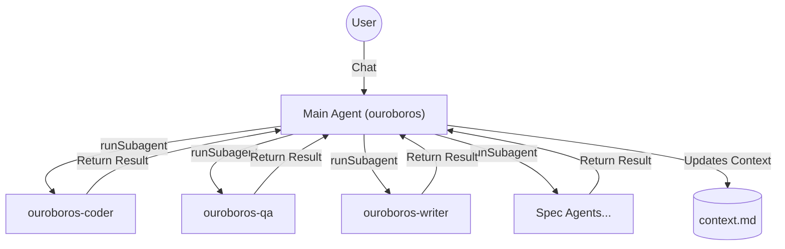

# ♾️ Project Ouroboros v2.0

> **Save Money on GitHub Copilot** — A persistent context system that reduces redundant conversations and maximizes your Copilot subscription value.

[](https://opensource.org/licenses/MIT)
[](https://github.com/features/copilot)
[](https://github.com/MLGBJDLW/ouroboros)

---

## 💰 Why Ouroboros?

GitHub Copilot charges by **request count**. Every time you re-explain your project, tech stack, or rehash previous conversations, you're **wasting requests**.

Ouroboros solves this:

| Problem | Ouroboros Solution |
|---------|-------------------|
| Re-introducing project every session | 🧠 **Persistent Memory** — AI reads `history/context-*.md` automatically |
| AI forgets after each response | ♾️ **Never Say Goodbye** — AI doesn't end conversations |
| Vague instructions cause rework | 🎯 **Sub-Agent Routing** — Tasks auto-route to specialists via `runSubagent` |
| Code gets lost in handoffs | 📦 **Lossless Artifacts** — Code passed verbatim, never summarized |

---

## 🚀 Quick Start (3 Steps!)

### Step 1: Copy to Your Project

```bash
# Clone and copy core files
git clone https://github.com/MLGBJDLW/ouroboros.git .ouroboros-temp
cp -r .ouroboros-temp/.github .
cp -r .ouroboros-temp/.ouroboros .
rm -rf .ouroboros-temp
```

Or manually copy these folders to your project root:
- `.github/` — Contains Copilot instructions and agents
- `.ouroboros/` — Contains the persistent memory files

### Step 2: Enable Custom Instructions in VS Code

1. Open Settings (`Ctrl+,` / `Cmd+,`)
2. Search: `github.copilot.chat.codeGeneration.useInstructionFiles`
3. ✅ **Enable it**

### Step 3: Enable VS Code Settings (Important!)

Enable these settings for full functionality:

| Setting | Search For | Purpose |
|---------|------------|---------|
| 🔧 **Custom Instructions** | `github.copilot.chat.codeGeneration.useInstructionFiles` | Load `.github/copilot-instructions.md` |
| 🤖 **Agent Mode** | `github.copilot.chat.agent` | Enable agent-based interactions |

> **Note**: Ouroboros v2.0 requires the **Main Orchestrator Agent** (`ouroboros.agent.md`). Do not invoke subagents directly; always start with `@ouroboros`.

---

## 🤖 Custom Agents (12 Specialists)

All agents are located in `.github/agents/`. The orchestrator (`ouroboros`) strictly manages them using `runSubagent()`.

### Core Agents
| Agent | Role |
|-------|------|
| `ouroboros` | **ORCHESTRATOR**. The only agent you talk to. Delegates everything. |
| `ouroboros-coder` | Full-stack development (Edit, Execute, Build) |
| `ouroboros-qa` | Unified Testing & Debugging (Fix-Verify Cycle) |
| `ouroboros-writer` | Documentation & File Writing (No code logic) |
| `ouroboros-devops` | CI/CD, Docker, Deployment |
| `ouroboros-analyst` | Read-only Codebase Analysis |
| `ouroboros-security`| Security Audits & Vulnerability Checks |

### Spec Workflow Agents
| Agent | Role |
|-------|------|
| `ouroboros-researcher` | Project Research (Phase 1) |
| `ouroboros-requirements` | EARS Requirements (Phase 2) |
| `ouroboros-architect` | System Design & ADRs (Phase 3) |
| `ouroboros-tasks` | Task Breakdown & Planning (Phase 4) |
| `ouroboros-validator` | Consistency & Logic Verification (Phase 5) |

---

## 🧠 How It Works: The v2.0 Architecture

### Centralized Orchestration

Ouroboros v2.0 uses a strict **Hub-and-Spoke** model. You never talk to the subagents; you talk to the Orchestrator, and it calls them for you.



### The Return Protocol

To prevent agents from "hallucinating" success or getting lost:
1. Orchestrator calls `runSubagent(agent: "ouroboros-coder", task: "Implement auth")`.
2. Subagent activates, reads context, does the work.
3. Subagent **MUST** return a structured result to the Orchestrator.
4. Orchestrator verifies the work and either completes the task or loops back.

---

## ♾️ Core Usage: Persistent Sessions

The foundation of Ouroboros is the **persistent session loop** — AI that never forgets and never says goodbye.

### Start a Session

```
@ouroboros /start
```

or simply start chatting with `@ouroboros`.

This command:
1. ✅ Loads your project context from `history/context-*.md`
2. ✅ Activates the **Continuous Command Loop (CCL)**
3. ✅ Routes tasks to specialized sub-agents automatically
4. ✅ Never ends until you say "stop", "end", "terminate", or "quit"

### The "Never Say Goodbye" Protocol

Once `@ouroboros` is active, the AI will:
- ❌ Never say "Let me know if you need anything else"
- ❌ Never end the conversation prematurely
- ✅ Always execute: `python -c "task = input('[Ouroboros] > ')"` after each task
- ✅ Wait for your next instruction continuously

---

## 📋 Spec-Driven Development

For complex features, use the structured spec workflow:

| Command | Purpose |
|---------|---------|
| `/ouroboros-init` | 🆕 First-time project research & setup |
| `/ouroboros-spec` | Create Research → Requirements → Design → Tasks |
| `/ouroboros-implement` | Auto-execute tasks.md |
| `/ouroboros-archive` | Archive completed specs |

### 🎮 Execution Modes (`/ouroboros-implement`)

Choose how to execute your implementation plan:

| Mode | Speed | Control | Best For |
|------|-------|---------|----------|
| 🔧 **Task-by-Task** | Slowest | Highest | High-risk changes, learning |
| 📦 **Phase-by-Phase** | Medium | Medium | Normal development |
| 🚀 **Auto-Run All** | Fastest | Lowest | Low-risk, trusted tasks |

---

## 🛡️ Safety & Reliability

- **Destructive Command Protection**: `rm -rf`, `git reset --hard` require confirmation
- **Verification Gate**: Code is verified before delivery
- **QA Agent Fix-Verify Cycle**: Self-contained testing and debugging with 3-cycle limit
- **Fail-Safe Protocols**:
  - 🏗️ **Coder**: Must pass build/typecheck before completion
  - 🚀 **DevOps**: Auto-rollback if exit code > 0
  - 🛑 **Git**: Immediate halt on merge conflicts
- **RETURN PROTOCOL**: All subagents return to orchestrator after completion

---

## 📁 File Structure

```
your-project/
├── .github/
│   ├── copilot-instructions.md    ← Copilot reads this automatically
│   ├── agents/                    ← 🤖 Agent definitions
│   │   ├── ouroboros.agent.md     ← MAIN ORCHESTRATOR
│   │   ├── ouroboros-coder.agent.md
│   │   └── ... (11 subagents)
│   └── prompts/                   ← Slash command prompts
├── .ouroboros/
│   ├── templates/                 ← 📋 All templates (READ ONLY)
│   ├── history/                   ← 📜 Active session files
│   ├── subagent-docs/             ← 📄 Long output storage
│   └── specs/                     ← 📋 Feature specifications
└── ... your project files
```

---

## 🙏 Acknowledgments

Ouroboros was inspired by:

- **[TaskSync](https://github.com/4regab/TaskSync)** — The original concept of persistent AI sessions and the "never say goodbye" protocol. Many of Ouroboros's core ideas evolved from TaskSync's pioneering work.

---

## 📜 License

MIT License — Free for personal and commercial use.

---

<p align="center">
  <strong>♾️ The Serpent Consumes Its Tail. The Loop Never Ends. ♾️</strong>
</p>
