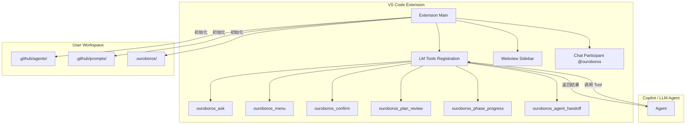

# Ouroboros Extension 架构深度解析与战略规划

## 1. 核心目标

将 Ouroboros 的 TUI 交互体验迁移到 VS Code Extension 的 Sidebar UI，同时保持与现有 TUI 的兼容性。

**关键决策：**

- **纯 TypeScript 实现**：参考 Seamless Agent，不需要 Python 后端
- **LM Tools 集成**：通过 `vscode.lm.registerTool()` 注册工具，让 Copilot 等 Agent 调用
- **Prompts 内置分发**：Extension 内置 Prompts/Agents，安装后一键初始化到用户 workspace
- **双模式兼容**：Prompts 支持 Extension 模式（Tool 调用）和 TUI 模式（Python 命令）自动切换
- **统一版本发布**：Extension 和 Prompts 使用同一版本号，一次 tag 同时发布两个产物

---

## 2. 架构模式：纯 TypeScript Extension

### 2.1 架构拓扑



### 2.2 核心组件

| 组件 | 职责 |
| :--- | :--- |
| **LM Tools** | 注册 6 个核心工具 |
| **Webview Sidebar** | 显示待处理请求、工作流进度、Agent 层级、历史记录 |
| **Chat Participant** | 可选的 `@ouroboros` 入口 |
| **Resource Initializer** | 将内置的 Prompts/Agents 释放到用户 workspace |

---

## 3. LM Tools 定义（6 个）

### 3.1 CCL 基础工具（3 个）

Extension 需要注册以下工具，替代现有的 Python CCL 命令：

| Tool 名称 | 覆盖 CCL 类型 | 输入参数 |
| :--- | :--- | :--- |
| `ouroboros_ask` | Type A, A+Q, C, E | `{ question?: string, type?: 'task'|'question'|'feature', inputLabel?: string }` |
| `ouroboros_menu` | Type B | `{ question: string, options: string[], allowCustom?: boolean }` |
| `ouroboros_confirm` | Type D | `{ question: string, yesLabel?: string, noLabel?: string }` |

### 3.2 Ouroboros 特色工具（3 个）

| Tool 名称 | 用途 | 输入参数 |
| :--- | :--- | :--- |
| `ouroboros_plan_review` | 计划/文档审批 | `{ plan: string, title?: string, mode?: 'review'|'walkthrough' }` |
| `ouroboros_phase_progress` | 显示阶段进度 | `{ workflow: 'spec'|'implement', specName: string, currentPhase: number, totalPhases: number, status: string }` |
| `ouroboros_agent_handoff` | Agent 交接通知 | `{ from: string, to: string, fromLevel: 0|1|2, toLevel: 0|1|2, reason?: string }` |

---

## 4. CCL 双模式兼容

### 4.1 模式检测

在 `copilot-instructions.md` 中添加模式自动检测：

```markdown
## CCL MODE

**检测方式**：检查是否有 `ouroboros_ask` 工具可用

| 模式 | 条件 | CCL 方式 |
|------|------|----------|
| **Extension** | `ouroboros_ask` 工具存在 | 调用 Tool |
| **TUI** | 工具不存在 | `python -c "..."` |
```

### 4.2 CCL 调用对照表

| CCL 类型 | Extension 模式 | TUI 模式 |
|------|---------------|----------|
| Type A: TASK | `ouroboros_ask({ type: 'task' })` | `python -c "task = input('[Ouroboros] > ')"` |
| Type A+Q: TASK+Q | `ouroboros_ask({ question: "Q", type: 'task' })` | `python -c "print('Q'); task = input('[Ouroboros] > ')"` |
| Type B: MENU | `ouroboros_menu({ question: "Q", options: ["A", "B"] })` | `python -c "print('[1] A'); choice = input('Select: ')"` |
| Type C: FEATURE | `ouroboros_ask({ question: "Q", type: 'feature' })` | `python -c "print('Q'); feature = input('Feature: ')"` |
| Type D: CONFIRM | `ouroboros_confirm({ question: "Q" })` | `python -c "confirm = input('[y/n]: ')"` |
| Type E: QUESTION | `ouroboros_ask({ question: "Q", type: 'question' })` | `python -c "answer = input('Your answer: ')"` |

---

## 5. Sidebar UI 设计

### 5.1 四大视图

| 视图 | Codicon | 内容 |
|:---|:---|:---|
| **Pending Requests** | `$(bell)` | 待处理的用户确认请求 |
| **Workflow Progress** | `$(pulse)` | 当前工作流阶段进度 |
| **Agent Hierarchy** | `$(organization)` | Level 0→1→2 的 Agent 调用链 |
| **History** | `$(history)` | 历史交互记录 |

### 5.2 Spec 工作流 UI（5 阶段）

```
+-------------------------------------------+
|  $(checklist) SPEC: auth-feature          |
+-------------------------------------------+
|  $(check) Phase 1: Research               |
|  $(check) Phase 2: Requirements           |
|  $(sync~spin) Phase 3: Design             |
|  $(circle-outline) Phase 4: Tasks         |
|  $(circle-outline) Phase 5: Validation    |
+-------------------------------------------+
|  $(arrow-right) ouroboros-architect       |
|  [View] [Cancel] [Skip]                   |
+-------------------------------------------+
```

### 5.3 Implement 工作流 UI（3 模式）

```
+-------------------------------------------+
|  $(gear) IMPLEMENT: auth-feature          |
+-------------------------------------------+
|  Mode: $(wrench) Task-by-Task             |
|  Progress: [=========>          ] 40%     |
+-------------------------------------------+
|  $(check) 1.1: Create controller          |
|  $(check) 1.2: Add JWT validation         |
|  $(arrow-right) 1.3: Login endpoint       |
|  $(circle-outline) 1.4: Rate limiting     |
+-------------------------------------------+
```

### 5.4 状态栏

```
$(infinity) Ouroboros | $(checklist) auth-feature (3/5) | $(robot) coder
```

### 5.5 Webview 技术栈

| 技术 | 选择 | 理由 |
|:---|:---|:---|
| **框架** | React 18 | 组件化开发、生态成熟、VS Code官方推荐 |
| **构建工具** | Vite | 快速HMR、开箱即用的TypeScript支持 |
| **CSS方案** | CSS Variables + CSS Modules | 利用VS Code主题变量、避免样式冲突 |
| **状态管理** | React Context + useReducer | 轻量级、无额外依赖 |
| **图标** | @vscode/codicons | 与VS Code原生一致的图标体验 |

### 5.6 暗/亮主题适配

使用 VS Code 内置的 CSS 变量实现自动主题适配：

```css
/* webview/styles/variables.css */
:root {
  /* 继承 VS Code 主题变量 */
  --background: var(--vscode-sideBar-background);
  --foreground: var(--vscode-sideBar-foreground);
  --border: var(--vscode-sideBar-border);
  
  /* 交互状态 */
  --button-background: var(--vscode-button-background);
  --button-foreground: var(--vscode-button-foreground);
  --button-hover: var(--vscode-button-hoverBackground);
  
  /* 列表项 */
  --list-hover: var(--vscode-list-hoverBackground);
  --list-active: var(--vscode-list-activeSelectionBackground);
  
  /* 状态指示 */
  --success: var(--vscode-testing-iconPassed);
  --warning: var(--vscode-editorWarning-foreground);
  --error: var(--vscode-editorError-foreground);
  --info: var(--vscode-editorInfo-foreground);
  
  /* 进度条 */
  --progress-background: var(--vscode-progressBar-background);
}
```

> [!TIP]
> 使用 VS Code 原生 CSS 变量可确保 Sidebar 在任何主题下都保持视觉一致性，无需维护暗/亮两套样式。

### 5.7 React 组件架构

```
webview/
├── src/
│   ├── App.tsx                 ← 根组件，路由/视图切换
│   ├── main.tsx                ← 入口，挂载React应用
│   │
│   ├── components/             ← 通用UI组件
│   │   ├── Button/
│   │   │   ├── Button.tsx
│   │   │   ├── Button.module.css
│   │   │   └── index.ts
│   │   ├── Icon/
│   │   │   ├── Icon.tsx        ← 封装Codicon
│   │   │   └── index.ts
│   │   ├── ProgressBar/
│   │   │   ├── ProgressBar.tsx
│   │   │   ├── ProgressBar.module.css
│   │   │   └── index.ts
│   │   ├── Badge/
│   │   ├── Card/
│   │   ├── List/
│   │   └── index.ts            ← 统一导出
│   │
│   ├── views/                  ← 四大视图组件
│   │   ├── PendingRequests/
│   │   │   ├── PendingRequests.tsx
│   │   │   ├── PendingRequests.module.css
│   │   │   ├── RequestCard.tsx
│   │   │   ├── RequestActions.tsx
│   │   │   └── index.ts
│   │   ├── WorkflowProgress/
│   │   │   ├── WorkflowProgress.tsx
│   │   │   ├── WorkflowProgress.module.css
│   │   │   ├── PhaseItem.tsx
│   │   │   ├── ProgressIndicator.tsx
│   │   │   └── index.ts
│   │   ├── AgentHierarchy/
│   │   │   ├── AgentHierarchy.tsx
│   │   │   ├── AgentHierarchy.module.css
│   │   │   ├── AgentNode.tsx
│   │   │   ├── HandoffArrow.tsx
│   │   │   └── index.ts
│   │   └── History/
│   │       ├── History.tsx
│   │       ├── History.module.css
│   │       ├── HistoryItem.tsx
│   │       ├── HistoryFilters.tsx
│   │       └── index.ts
│   │
│   ├── context/                ← React Context
│   │   ├── AppContext.tsx      ← 全局状态
│   │   ├── ThemeContext.tsx    ← 主题相关
│   │   └── VSCodeContext.tsx   ← VS Code API 封装
│   │
│   ├── hooks/                  ← 自定义Hooks
│   │   ├── useVSCodeMessage.ts ← Extension通信
│   │   ├── useWorkflow.ts      ← 工作流状态
│   │   ├── usePendingRequests.ts
│   │   └── useHistory.ts
│   │
│   ├── types/                  ← TypeScript类型
│   │   ├── requests.ts
│   │   ├── workflow.ts
│   │   ├── agent.ts
│   │   └── messages.ts         ← Webview↔Extension消息类型
│   │
│   ├── utils/                  ← 工具函数
│   │   ├── formatters.ts       ← 日期、状态格式化
│   │   ├── validators.ts
│   │   └── vscodeApi.ts        ← acquireVsCodeApi封装
│   │
│   └── styles/                 ← 全局样式
│       ├── variables.css       ← CSS变量（主题）
│       ├── reset.css           ← 样式重置
│       └── global.css          ← 全局样式
│
├── public/
│   └── index.html
│
├── vite.config.ts
├── tsconfig.json
└── package.json
```

> [!IMPORTANT]
> **组件拆分原则**：
> - 每个组件目录包含：组件文件、样式模块、index导出
> - 单个组件文件不超过 **200 行**
> - 复杂视图拆分为多个子组件
> - 业务逻辑抽取到自定义 Hooks

---

## 6. 构建时 Prompts 转换

### 6.1 Extension 转换脚本

仿照 `ouroboros_toggle.py`，在 `extension/scripts/` 创建 `transform-to-extension.ts`：

```typescript
// extension/scripts/transform-to-extension.ts

const PATTERNS = {
  // Type A: Standard CCL
  taskInput: {
    from: /python -c "task = input\('\[Ouroboros\] > '\)"/g,
    to: 'ouroboros_ask({ type: "task" })'
  },
  
  // Type A+Q: Task with question
  taskWithQuestion: {
    from: /python -c "print\('([^']*)'\); task = input\('\[Ouroboros\] > '\)"/g,
    to: (_, question) => `ouroboros_ask({ question: "${question}", type: "task" })`
  },
  
  // Type B: Menu
  menu: {
    from: /python -c "print\('([^']*)'\); print\(\);((?:\s*print\('\[[^\]]+\][^']*'\);)+)\s*choice = input\('([^']*)'\)"/g,
    to: (_, question, optionsBlock, prompt) => {
      const options = optionsBlock.match(/\[(\d+)\]\s*([^']*)/g) || [];
      return `ouroboros_menu({ question: "${question}", options: ${JSON.stringify(options)} })`;
    }
  },
  
  // Type D: Confirm
  confirm: {
    from: /python -c "print\('([^']*)'\);[^"]*confirm = input\('\[y\/n\]: '\)"/g,
    to: (_, question) => `ouroboros_confirm({ question: "${question}" })`
  }
};
```

### 6.2 构建流程

```
npm run build
    │
    ├── 1. transform-to-extension.ts
    │      读取 ../.github/agents/*.md
    │      读取 ../.github/prompts/*.md
    │      应用转换规则
    │      输出到 extension/resources/
    │
    ├── 2. tsc (编译 TypeScript)
    │
    └── 3. vsce package (打包 vsix)
```

---

## 7. 项目结构

### 7.1 顶层目录

```
ouroboros/
├── .github/
│   ├── agents/                  ← 16 个 Agent 定义（共用）
│   ├── prompts/                 ← Slash Commands（共用）
│   ├── copilot-instructions.md  ← 全局规则（需更新支持双模式）
│   └── workflows/
│       ├── ci.yml               ← 需更新：添加 Extension 构建检查
│       └── release.yml          ← 需更新：同时发布 Extension
├── extension/                   ← VS Code Extension（详见下方）
├── .ouroboros/
│   ├── scripts/                 ← TUI 脚本（保留）
│   └── templates/               ← Spec 模板
└── docs/
    └── extension-architecture-analysis.md  ← 本文档
```

### 7.2 Extension 目录详细结构

```
extension/
├── src/                         ← Extension 主代码
│   ├── extension.ts             ← 入口点，activate/deactivate
│   ├── constants.ts             ← 常量定义
│   │
│   ├── tools/                   ← LM Tools 实现（6个）
│   │   ├── index.ts             ← 统一注册入口
│   │   ├── types.ts             ← Tool 输入/输出类型
│   │   ├── schemas.ts           ← Zod 验证 Schema
│   │   ├── ask.ts               ← ouroboros_ask
│   │   ├── menu.ts              ← ouroboros_menu
│   │   ├── confirm.ts           ← ouroboros_confirm
│   │   ├── planReview.ts        ← ouroboros_plan_review
│   │   ├── phaseProgress.ts     ← ouroboros_phase_progress
│   │   └── handoff.ts           ← ouroboros_agent_handoff
│   │
│   ├── webview/                 ← Webview Provider
│   │   ├── SidebarProvider.ts   ← WebviewViewProvider 实现
│   │   ├── messageHandler.ts    ← 消息处理分发
│   │   └── htmlGenerator.ts     ← HTML 生成（嵌入React）
│   │
│   ├── storage/                 ← 状态持久化
│   │   ├── stateManager.ts      ← 主状态管理器
│   │   ├── workspaceState.ts    ← Workspace 级别状态
│   │   └── globalState.ts       ← 全局状态
│   │
│   ├── commands/                ← VS Code Commands
│   │   ├── index.ts             ← 命令注册
│   │   ├── initializeProject.ts ← 初始化项目命令
│   │   ├── openSidebar.ts       ← 打开 Sidebar
│   │   └── clearHistory.ts      ← 清除历史记录
│   │
│   ├── statusBar/               ← 状态栏
│   │   ├── StatusBarManager.ts  ← 状态栏管理
│   │   └── formatters.ts        ← 状态栏文本格式化
│   │
│   └── utils/                   ← 工具类
│       ├── logger.ts            ← 日志输出
│       ├── disposable.ts        ← Disposable 管理
│       └── debounce.ts          ← 防抖工具
│
├── webview/                     ← React Webview 应用
│   ├── src/
│   │   ├── App.tsx              ← 根组件
│   │   ├── main.tsx             ← React 入口
│   │   │
│   │   ├── components/          ← 通用 UI 组件（详见 5.7）
│   │   │   ├── Button/
│   │   │   ├── Icon/
│   │   │   ├── ProgressBar/
│   │   │   ├── Badge/
│   │   │   ├── Card/
│   │   │   ├── List/
│   │   │   └── index.ts
│   │   │
│   │   ├── views/               ← 四大视图
│   │   │   ├── PendingRequests/
│   │   │   ├── WorkflowProgress/
│   │   │   ├── AgentHierarchy/
│   │   │   └── History/
│   │   │
│   │   ├── context/             ← React Context
│   │   │   ├── AppContext.tsx
│   │   │   ├── ThemeContext.tsx
│   │   │   └── VSCodeContext.tsx
│   │   │
│   │   ├── hooks/               ← 自定义 Hooks
│   │   │   ├── useVSCodeMessage.ts
│   │   │   ├── useWorkflow.ts
│   │   │   ├── usePendingRequests.ts
│   │   │   └── useHistory.ts
│   │   │
│   │   ├── types/               ← TypeScript 类型
│   │   │   ├── requests.ts
│   │   │   ├── workflow.ts
│   │   │   ├── agent.ts
│   │   │   └── messages.ts
│   │   │
│   │   ├── utils/               ← 工具函数
│   │   │   ├── formatters.ts
│   │   │   ├── validators.ts
│   │   │   └── vscodeApi.ts
│   │   │
│   │   └── styles/              ← 全局样式
│   │       ├── variables.css
│   │       ├── reset.css
│   │       └── global.css
│   │
│   ├── public/
│   │   └── index.html
│   ├── vite.config.ts
│   ├── tsconfig.json
│   └── package.json             ← Webview 独立依赖
│
├── resources/                   ← 静态资源
│   ├── icon.png                 ← Marketplace 图标 ✅ 已生成
│   ├── icon.svg                 ← Activity Bar 图标 ✅ 已生成
│   └── prompts/                 ← 内置 Prompts（构建时复制）
│       ├── agents/
│       └── prompts/
│
├── scripts/                     ← 构建脚本
│   ├── build-webview.ts         ← 构建 React 应用
│   ├── transform-prompts.ts     ← CCL 转换脚本
│   └── copy-resources.ts        ← 复制资源文件
│
├── .vscode/                     ← 开发配置
│   ├── launch.json              ← F5 调试配置
│   ├── tasks.json               ← 构建任务
│   └── settings.json            ← 项目设置
│
├── package.json                 ← Extension 主 package.json
├── tsconfig.json                ← TypeScript 配置
├── esbuild.config.js            ← Extension 打包配置
└── README.md                    ← Extension 说明
```

> [!NOTE]
> **目录分离原则**：
> - `src/` 存放 Extension 主代码（Node.js 环境）
> - `webview/` 存放 React 应用（浏览器环境）
> - 两者通过消息机制通信，保持独立构建


---

## 8. 状态持久化

### 8.1 存储策略

```typescript
// Workspace 级别
workspaceState: {
    currentSpec: string;
    currentPhase: number;
    taskProgress: Record<string, boolean>;
    executionMode: 'task-by-task' | 'phase-by-phase' | 'auto-run';
}

// 全局级别
globalState: {
    interactionHistory: StoredInteraction[];
}
```

### 8.2 数据结构

```typescript
interface StoredInteraction {
    id: string;
    timestamp: number;
    type: 'ask' | 'menu' | 'confirm' | 'plan_review' | 'phase_complete';
    agentName: string;
    agentLevel: 0 | 1 | 2;
    question?: string;
    response?: string;
    status: 'pending' | 'responded' | 'cancelled' | 'timeout';
    workflowContext?: {
        workflow: 'spec' | 'implement' | 'archive';
        specName: string;
        phase?: number;
    };
}
```

---

## 9. 错误处理与降级

### 9.1 Fallback 机制

```typescript
async function handleToolInvocation(tool: string, params: any): Promise<ToolResult> {
    try {
        return await webviewHandler(tool, params);
    } catch (e) {
        if (e instanceof WebviewNotAvailableError) {
            return await fallbackToVSCodeDialog(tool, params);
        }
        throw e;
    }
}
```

### 9.2 超时处理

| 场景 | 超时时间 | 处理方式 |
|:---|:---|:---|
| 用户确认请求 | 5 分钟 | 提示用户，保持 pending |
| 阶段等待 | 无限 | 允许手动取消 |
| 自动运行模式 | 30 秒/任务 | 暂停并询问用户 |

---

## 10. 输入验证

```typescript
import { z } from 'zod';

export const AskInputSchema = z.object({
    question: z.string().optional(),
    type: z.enum(['task', 'question', 'feature']).optional(),
    inputLabel: z.string().optional(),
    agentName: z.string().optional(),
    agentLevel: z.number().min(0).max(2).optional()
});

export const MenuInputSchema = z.object({
    question: z.string().min(1),
    options: z.array(z.string()).min(1).max(10),
    allowCustom: z.boolean().optional()
});
```

---

## 11. 发布策略

### 11.1 统一版本号

Prompts 和 Extension 使用同一版本号，一次 tag 同时发布。

```
v3.2.0 → Prompts v3.2.0 + Extension v3.2.0
```

### 11.2 发布产物

| 产物 | 发布到 | 内容 |
|------|--------|------|
| `ouroboros-v*.zip` | GitHub Release | Prompts + Agents + Templates + TUI Scripts |
| `ouroboros-v*.vsix` | VS Code Marketplace | Extension + 内置资源 |

### 11.3 CI/CD 更新

**ci.yml 新增：**
```yaml
  build-extension:
    name: Build Extension
    runs-on: ubuntu-latest
    steps:
      - uses: actions/checkout@v4
      - uses: actions/setup-node@v4
        with:
          node-version: '20'
      - name: Install dependencies
        working-directory: extension
        run: npm ci
      - name: Build
        working-directory: extension
        run: npm run compile
      - name: Package
        working-directory: extension
        run: npx vsce package --no-dependencies
```

**release.yml 新增：**
```yaml
      - name: Build Extension
        working-directory: extension
        run: |
          npm ci
          npm run compile
          npx vsce package --no-dependencies -o ../ouroboros-v${{ steps.version.outputs.version }}.vsix

      - name: Create GitHub Release
        uses: softprops/action-gh-release@v2
        with:
          files: |
            ouroboros-v${{ steps.version.outputs.version }}.zip
            ouroboros-v${{ steps.version.outputs.version }}.vsix
```

---

## 12. Extension 图标资源

### 12.1 图标文件

Extension 图标已经生成，有两种格式：

| 文件 | 格式 | 用途 | 状态 |
|:---|:---|:---|:---:|
| `extension/resources/icon.png` | PNG | VS Code Marketplace、Extension Gallery 显示 | ✅ 已生成 |
| `extension/resources/icon.svg` | SVG | 高分辨率显示、可缩放场景 | ✅ 已生成 |

### 12.2 环境使用策略

根据不同的环境和使用场景，选择合适的图标格式：

| 场景 | 推荐格式 | 原因 |
|:---|:---|:---|
| **VS Code Marketplace** | PNG | Marketplace 要求 PNG 格式，128x128 或更大 |
| **Extension Icon（package.json）** | PNG | VS Code Extension API 主要支持 PNG |
| **Sidebar 图标** | SVG | 支持动态着色和暗/亮主题适配 |
| **状态栏图标** | — | 使用 Codicons，不使用自定义图标 |
| **Webview 内容** | SVG | 矢量缩放、高 DPI 支持 |

### 12.3 完整 package.json 模板

```json
{
  "name": "ouroboros",
  "displayName": "Ouroboros",
  "description": "Structured AI agent workflow with spec-driven development",
  "version": "3.0.0",
  "publisher": "ouroboros",
  "license": "MIT",
  "icon": "resources/icon.png",
  "repository": {
    "type": "git",
    "url": "https://github.com/yourusername/ouroboros"
  },
  "engines": {
    "vscode": "^1.95.0"
  },
  "categories": [
    "AI",
    "Chat",
    "Programming Languages"
  ],
  "keywords": [
    "ai",
    "copilot",
    "agent",
    "workflow",
    "spec"
  ],
  "activationEvents": [
    "onStartupFinished"
  ],
  "main": "./dist/extension.js",
  "contributes": {
    "viewsContainers": {
      "activitybar": [
        {
          "id": "ouroboros-sidebar",
          "title": "Ouroboros",
          "icon": "resources/icon.svg"
        }
      ]
    },
    "views": {
      "ouroboros-sidebar": [
        {
          "type": "webview",
          "id": "ouroboros.sidebarView",
          "name": "Ouroboros",
          "contextualTitle": "Ouroboros Workflow"
        }
      ]
    },
    "commands": [
      {
        "command": "ouroboros.initializeProject",
        "title": "Initialize Ouroboros Project",
        "category": "Ouroboros"
      },
      {
        "command": "ouroboros.openSidebar",
        "title": "Open Sidebar",
        "category": "Ouroboros"
      },
      {
        "command": "ouroboros.clearHistory",
        "title": "Clear Interaction History",
        "category": "Ouroboros"
      },
      {
        "command": "ouroboros.cancelCurrentRequest",
        "title": "Cancel Current Request",
        "category": "Ouroboros"
      }
    ],
    "menus": {
      "commandPalette": [
        {
          "command": "ouroboros.initializeProject",
          "when": "workspaceFolderCount > 0"
        }
      ]
    },
    "configuration": {
      "title": "Ouroboros",
      "properties": {
        "ouroboros.executionMode": {
          "type": "string",
          "default": "task-by-task",
          "enum": ["task-by-task", "phase-by-phase", "auto-run"],
          "enumDescriptions": [
            "Confirm each task before execution",
            "Confirm each phase before execution", 
            "Run all tasks automatically"
          ],
          "description": "Default execution mode for implement workflow"
        },
        "ouroboros.showStatusBar": {
          "type": "boolean",
          "default": true,
          "description": "Show Ouroboros status in the status bar"
        },
        "ouroboros.historyLimit": {
          "type": "number",
          "default": 100,
          "description": "Maximum number of interactions to keep in history"
        }
      }
    },
    "languageModelTools": [
      {
        "name": "ouroboros_ask",
        "displayName": "Ask User",
        "description": "Ask the user for input or task description",
        "modelDescription": "Use this tool to get input from the user. Supports task input, questions, and feature descriptions.",
        "canBeReferencedInPrompt": true,
        "inputSchema": {
          "type": "object",
          "properties": {
            "question": {
              "type": "string",
              "description": "Optional question or prompt to show the user"
            },
            "type": {
              "type": "string",
              "enum": ["task", "question", "feature"],
              "description": "Type of input expected"
            },
            "inputLabel": {
              "type": "string",
              "description": "Label for the input field"
            }
          }
        }
      },
      {
        "name": "ouroboros_menu",
        "displayName": "Show Menu",
        "description": "Present a menu of options to the user",
        "modelDescription": "Use this tool to present multiple choice options to the user.",
        "canBeReferencedInPrompt": true,
        "inputSchema": {
          "type": "object",
          "required": ["question", "options"],
          "properties": {
            "question": {
              "type": "string",
              "description": "Question or prompt for the menu"
            },
            "options": {
              "type": "array",
              "items": { "type": "string" },
              "description": "List of options to choose from"
            },
            "allowCustom": {
              "type": "boolean",
              "description": "Allow custom input in addition to options"
            }
          }
        }
      },
      {
        "name": "ouroboros_confirm",
        "displayName": "Confirm Action",
        "description": "Ask the user for yes/no confirmation",
        "modelDescription": "Use this tool to get binary confirmation from the user.",
        "canBeReferencedInPrompt": true,
        "inputSchema": {
          "type": "object",
          "required": ["question"],
          "properties": {
            "question": {
              "type": "string",
              "description": "Confirmation question"
            },
            "yesLabel": {
              "type": "string",
              "description": "Label for yes button"
            },
            "noLabel": {
              "type": "string",
              "description": "Label for no button"
            }
          }
        }
      },
      {
        "name": "ouroboros_plan_review",
        "displayName": "Review Plan",
        "description": "Present a plan or document for user review",
        "modelDescription": "Use this tool to request user approval for a plan or walkthrough.",
        "canBeReferencedInPrompt": true,
        "inputSchema": {
          "type": "object",
          "required": ["plan"],
          "properties": {
            "plan": {
              "type": "string",
              "description": "The plan content in markdown format"
            },
            "title": {
              "type": "string",
              "description": "Title for the plan review"
            },
            "mode": {
              "type": "string",
              "enum": ["review", "walkthrough"],
              "description": "Review mode"
            }
          }
        }
      },
      {
        "name": "ouroboros_phase_progress",
        "displayName": "Update Phase Progress",
        "description": "Update and display workflow phase progress",
        "modelDescription": "Use this tool to report progress through workflow phases.",
        "canBeReferencedInPrompt": true,
        "inputSchema": {
          "type": "object",
          "required": ["workflow", "specName", "currentPhase", "totalPhases", "status"],
          "properties": {
            "workflow": {
              "type": "string",
              "enum": ["spec", "implement"],
              "description": "Workflow type"
            },
            "specName": {
              "type": "string",
              "description": "Name of the spec being processed"
            },
            "currentPhase": {
              "type": "number",
              "description": "Current phase number (1-indexed)"
            },
            "totalPhases": {
              "type": "number",
              "description": "Total number of phases"
            },
            "status": {
              "type": "string",
              "description": "Current status message"
            }
          }
        }
      },
      {
        "name": "ouroboros_agent_handoff",
        "displayName": "Agent Handoff",
        "description": "Notify of agent handoff between levels",
        "modelDescription": "Use this tool to signal that work is being handed off to another agent.",
        "canBeReferencedInPrompt": true,
        "inputSchema": {
          "type": "object",
          "required": ["from", "to", "fromLevel", "toLevel"],
          "properties": {
            "from": {
              "type": "string",
              "description": "Name of the source agent"
            },
            "to": {
              "type": "string",
              "description": "Name of the target agent"
            },
            "fromLevel": {
              "type": "number",
              "enum": [0, 1, 2],
              "description": "Level of source agent"
            },
            "toLevel": {
              "type": "number",
              "enum": [0, 1, 2],
              "description": "Level of target agent"
            },
            "reason": {
              "type": "string",
              "description": "Reason for handoff"
            }
          }
        }
      }
    ]
  },
  "scripts": {
    "vscode:prepublish": "npm run package",
    "compile": "npm run build-webview && esbuild ./src/extension.ts --bundle --outfile=dist/extension.js --external:vscode --format=cjs --platform=node",
    "watch": "npm run compile -- --watch",
    "build-webview": "cd webview && npm run build",
    "package": "npm run compile -- --minify",
    "lint": "eslint src --ext ts",
    "test": "vitest"
  },
  "devDependencies": {
    "@types/node": "^20.0.0",
    "@types/vscode": "^1.95.0",
    "@typescript-eslint/eslint-plugin": "^8.0.0",
    "@typescript-eslint/parser": "^8.0.0",
    "esbuild": "^0.24.0",
    "eslint": "^9.0.0",
    "typescript": "^5.0.0",
    "vitest": "^2.0.0"
  },
  "dependencies": {
    "zod": "^3.0.0"
  }
}
```

> [!IMPORTANT]
> **关键配置说明**：
> - `engines.vscode` 需要 1.95+ 以支持 `languageModelTools`
> - `activationEvents: onStartupFinished` 确保 Tools 在首次对话前注册
> - `languageModelTools` 定义了6个可被Copilot调用的工具
> - 每个Tool的 `inputSchema` 使用 JSON Schema 格式

---

## 13. 实施路线图

### Phase 1: 骨架搭建（1-2 周）

- [ ] 初始化 `extension/` 项目结构
- [ ] 实现基础 CCL Tools（ask, menu, confirm）
- [ ] 实现 Pending Requests View
- [ ] 验证 Copilot 能调用 Tool

### Phase 2: 工作流集成（2-3 周）

- [ ] 实现 plan_review, phase_progress
- [ ] 实现 Workflow Progress View
- [ ] 更新 Prompts 支持双模式检测

### Phase 3: 状态管理（1 周）

- [ ] 实现 agent_handoff
- [ ] 实现 Agent Hierarchy View
- [ ] 实现状态持久化

### Phase 4: CI/CD 集成（1 周）

- [ ] 实现 "Initialize Project" 命令
- [ ] 构建时 Prompts 转换脚本
- [ ] 更新 CI workflows
- [ ] 配置 VS Code Marketplace 发布

### Phase 5: UI 打磨（1-2 周）

- [ ] 美化 Sidebar
- [ ] 状态栏集成
- [ ] 文档编写

---

## 14. 本地测试流程

### 14.1 F5 调试模式

在 VS Code 里打开 `extension/` 文件夹，按 F5 启动调试：

**`.vscode/launch.json`:**
```json
{
  "version": "0.2.0",
  "configurations": [
    {
      "name": "Run Extension",
      "type": "extensionHost",
      "request": "launch",
      "args": ["--extensionDevelopmentPath=${workspaceFolder}"],
      "outFiles": ["${workspaceFolder}/dist/**/*.js"],
      "preLaunchTask": "npm: compile"
    }
  ]
}
```

### 14.2 本地安装 VSIX 测试

```powershell
cd extension
npm run package   # 生成 ouroboros-x.x.x.vsix
code --install-extension ouroboros-x.x.x.vsix
```

### 14.3 测试 LM Tools 是否被 Copilot 识别

Extension 激活后，在 Copilot Chat 里输入：

```
@workspace 请使用 ouroboros_ask 工具问我一个问题
```

---

## 15. VS Code Marketplace 发布流程

### 15.1 前置准备

1. 访问 https://dev.azure.com/ 创建组织
2. 创建 Personal Access Token (PAT)，Scope 选择 `Marketplace → Manage`
3. 创建 Publisher：`vsce create-publisher ouroboros`

### 15.2 CI/CD 自动发布

**配置 GitHub Secret：**

1. 进入 GitHub Repo → Settings → Secrets and variables → Actions
2. 添加 `VSCE_PAT` Secret

---

## 16. 参考实现

- **Seamless Agent**：LM Tools 注册、Webview Sidebar、用户确认流程
- **VS Code Codicons**：https://microsoft.github.io/vscode-codicons/
- **vsce 文档**：https://code.visualstudio.com/api/working-with-extensions/publishing-extension

---

**The Serpent Consumes Its Tail. The Loop Never Ends.**
